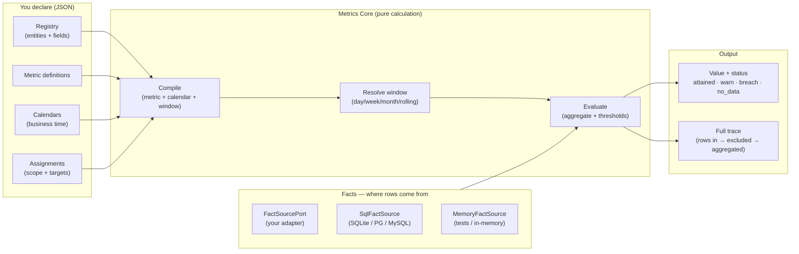
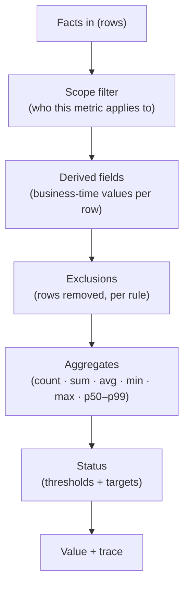

# 🏛️ Malkom Process Metrics & KPI Engine — Architecture

> The 10,000-foot view, then the details. Simple pointers — no philosophy.

---

## 🗺️ The big picture

**The one idea:** you declare the *meaning* of a metric; the engine computes it over your data — **read-only** — and hands back a value + a receipt (trace).

---

## 🪜 Layers

| Layer | Responsibility | Example modules |
|---|---|---|
| 🎛️ **Config** | Everything declared; zod = single source of truth | `config/` (schemas, validate, defaults, connection) |
| 🧠 **Domain** | Registry + filter vocabulary | `domain/` (filter, registry, ids, types) |
| ⚙️ **Runtime** | The pure calculation core | `runtime/` (calendar, window, compile, evaluate, calculate) |
| 🔌 **Ports** | Where your backend plugs in | `ports/` (factsource, statestore, sql, clock, logger) |
| 🗄️ **State** | Engine-owned state | `state/` (sqlite, memory) |
| 🕸️ **HTTP** | (landing zone for M4 control plane) | `http/` (auth scaffold) |
| 📡 **Telemetry** | Operational metrics | `telemetry/` |

---

## ⚡ The calculation pipeline

| Stage | What happens |
|---|---|
| **Scope** | Rows filtered to the metric's entity + assignment scope |
| **Derived fields** | Business-time values computed per row (exclusions may reference them) |
| **Exclusions** | Rows removed by declared exclusion rules — counted per rule |
| **Aggregation** | Pure math over the surviving values |
| **Status** | Compared against thresholds → `attained` / `warn` / `breach` |
| **Trace** | Rows in → rows remaining → rows excluded → values used |

> 🔁 **Deterministic & replayable:** same inputs → same values, forever. The trace is stored verbatim.

---

## 🪟 Windows & business time

| Window | Meaning |
|---|---|
| `day` · `week` · `month` · `quarter` | Periodic windows, timezone-resolved |
| `rolling-30d` · `rolling-4h` | Rolling windows — key includes the window (`rolling-30d:2026-08-12T10:00:00Z`) |

| Calendar feature | What it handles |
|---|---|
| Weekdays | Which days count as business days |
| Timezone | Per-calendar IANA timezone, DST-aware |
| DST ambiguity | Explicit policy for ambiguous wall times |
| Wall-clock conversion | `wallClockAt` / `wallTimeToInstant` helpers |

> 🗓️ Business time flows into evaluation — the trace always shows *how* alignment entered the calculation.

---

## 🔌 Ports & fact access

| Port | Purpose | Shipped implementation |
|---|---|---|
| `FactSourcePort` | Where metric rows come from | `MemoryFactSource` · your own adapter |
| SQL fetch | Read rows from the host DB (read-only) | `SqlFactSource` + `buildFactSelect` (SQLite / PG / MySQL) |
| `MetricsStateStore` | Definitions, calendars, assignments, records | SQLite (`node:sqlite`) · in-memory |
| `SqlClient` / `SqlIntrospector` | Dialect-safe SQL + live schema checks | SQLite / PG / MySQL clients |
| `Clock` / `Logger` | Time + logging seams | system clock · console logger |

> 🧩 Metrics are computed on **on-demand points** (`calculateMetric`) or **backtests** (`backtestMetric`) — never written back to your tables.

---

## ✅ Validation — evidence before trust

| Tier | What it checks |
|---|---|
| **Tier 1 (static)** | Shapes are valid: metric defs, calendars, assignments, registry |
| **Tier 2 (live)** | Referenced fields/columns actually exist in the live schema |

> `validateMetricLive` + `LiveSchemaAccess` power tier 2; issues come back as typed codes with a `ValidationResult`.

---

## 📡 Telemetry & errors

| Piece | What it gives you |
|---|---|
| `TelemetryRegistry` | Operational counters/timings |
| Typed errors | `ConfigInvalidError` · `NotFoundError` · `ConflictError` · `UnauthorizedError` · `StateStoreError` · … |
| Logger port | Console / no-op / your own |

---

## 🧭 Where this engine is on the roadmap

| Milestone | Status |
|---|---|
| **M0** — substrate (filter language, registry, ports, telemetry) | ✅ done |
| **M1** — authoring models (definitions, calendars, assignments) + tier-1 validation | ✅ done |
| **M2** — pure calculation core (business time, windows, compile, evaluate) | ✅ done |
| **M3** — fact access, calculate/backtest, defaults, tier-2 validation | ✅ done |
| **M4+** — engine facade, HTTP router, server + CLI shells | 🚧 next |

> 📌 **Today:** embed the library. **Soon:** same one-core / REST / CLI shape as the sibling engines.

---

## 🚀 Where to go next

- [`README.md`](./README.md) — the friendly overview
