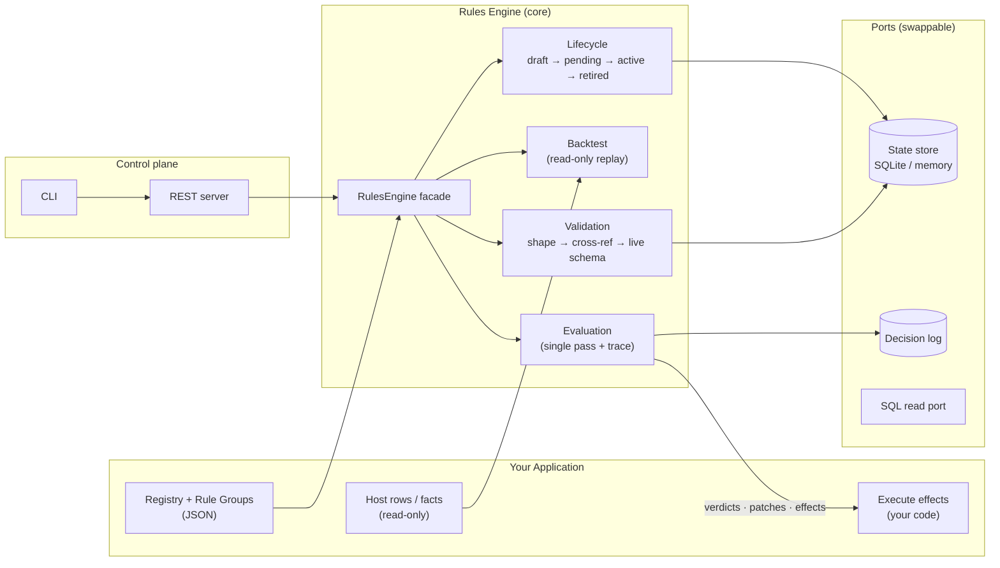
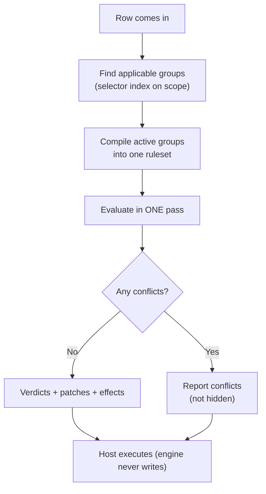
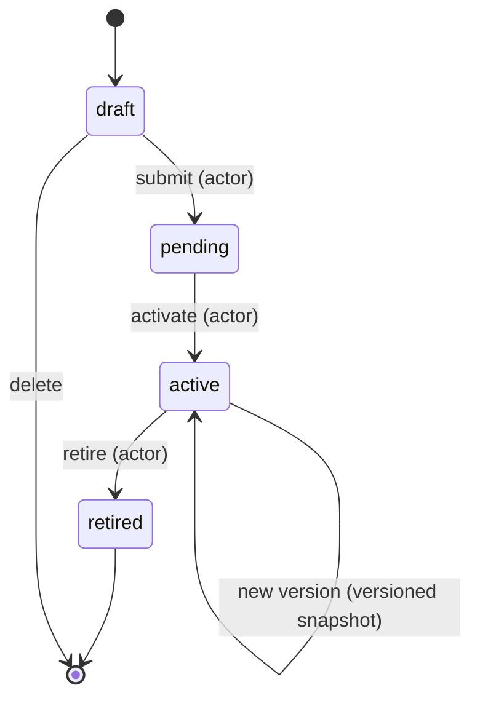
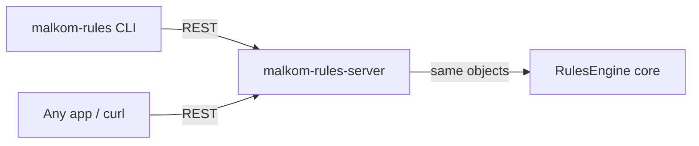

# 🏛️ Malkom Rules Engine — Architecture

> The 10,000-foot view, then the details. Everything is simple pointers — no philosophy.

---

## 🗺️ The big picture

**The one idea:** config and rows go **in**, verdicts and descriptors come **out** — the engine never writes your data.

---

## 🪜 Layers

| Layer | Responsibility | Example modules |
|---|---|---|
| 🎛️ **Config** | Declares everything; zod schemas are the single source of truth | `config/` (schemas, validate, jsonschema) |
| 🧠 **Domain** | The vocabulary: filters, registry, ids, types | `domain/` |
| ⚙️ **Runtime** | Pure evaluation logic | `runtime/` |
| 🔌 **Ports** | The seams where your backend plugs in | `ports/` (state store, sql, clock, logger) |
| 🗄️ **State** | Where engine state lives | `state/` (sqlite, memory) |
| 🕸️ **HTTP** | The control-plane surface | `http/` (auth, fetch handler) |

---

## 📁 Core modules

| Module | What it does |
|---|---|
| `engine.ts` | The `RulesEngine` facade — the only door you need |
| `domain/filter` | The condition language rules are written in |
| `domain/registry` | Compiles a registry into a fast, validated vocabulary |
| `config/validate` | Tiered validation (shape → cross-ref → live schema) |
| `runtime` | Single-pass evaluation engine with full traces |
| `state/` | Persistence for groups, versions, decisions |
| `metrics` | Prometheus metrics for observability |

---

## ⚡ The evaluation pipeline

| Rule | Why |
|---|---|
| **Single pass** | Deterministic, fast, no surprises |
| **Conflicts reported** | You see them — they're never silently resolved |
| **Full trace** | Every verdict explains *which rule fired and why* |

---

## 🔄 The lifecycle state machine

| Pointer | What it means |
|---|---|
| Every transition is **actor-stamped** | You always know who did what |
| Every activation is a **versioned snapshot** | Immutable, replayable |
| **Who may approve is the host's rule** | The engine enforces *legality*, you decide *authority* |

---

## 🔌 Ports & adapters

| Port | Purpose | Shipped implementation |
|---|---|---|
| `RulesStateStore` | Groups, versions, decisions, retention | SQLite (`node:sqlite`) · in-memory · your own |
| SQL read | Reading host rows for backtests / validation | SQLite / Postgres / MySQL clients |
| `Clock` / `Logger` | Time + logging seams | system clock · console logger |

> 🧩 **Anything else?** Implement a port, register it, done. ~60 lines for a custom backend.

---

## 🛡️ Design rules (the important ones)

| # | Rule |
|---|---|
| D1 | **The engine never writes host tables** — it reads, never mutates |
| D2 | **Effects are descriptors** — your app executes them transactionally |
| D3 | **Lifecycle is a state machine** — legality enforced, authority is yours |
| D4 | **One runtime dependency** (`zod`) — small, auditable |
| D5 | **Single-pass evaluation** — conflicts reported, not hidden |
| D6 | **The engine is the only query surface** for rule data — no reaching into its tables |

---

## 🕸️ Control plane

| Surface | Env / flags you'll care about |
|---|---|
| Server | `MALKOM_RULES_PORT`, `_HOST`, `_STATE_DB`, `_ADMIN_KEYS`, `_READ_KEYS`, `_REGISTRY` |
| CLI | `MALKOM_RULES_URL`, `MALKOM_RULES_API_KEY` |
| Discovery | `GET /v1` — what's actually registered at boot |
| Schemas | `GET /v1/schemas` — JSON Schema for every config document |

> 🔑 **Auth:** admin + read bearer keys. If no keys are set, the control plane is **open** — and the server warns loudly.

---

## 📊 How state is stored

| State | Where |
|---|---|
| Registry + group versions | `RulesStateStore` (SQLite by default) |
| Decision log | `RulesStateStore` — append-only, queryable, retention policies |
| Backtest reads | Host tables, **read-only** |

---

## 🚀 Where to go next

- [`README.md`](./README.md) — the friendly overview
- Engine root `README.md` — full API + server/CLI walkthrough
