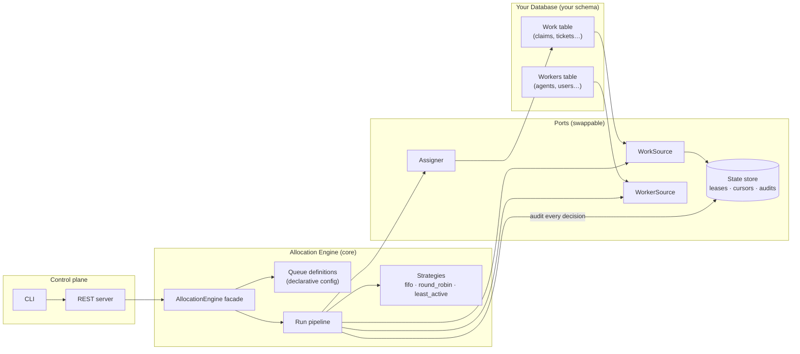
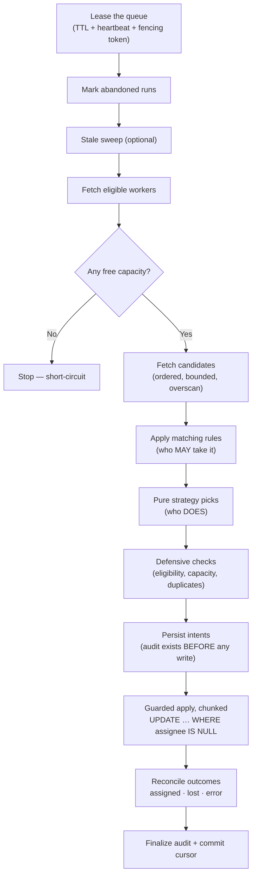
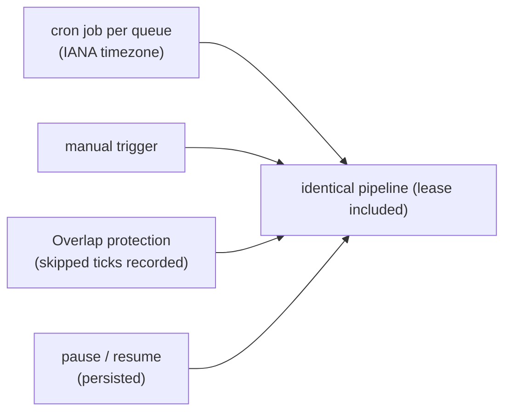
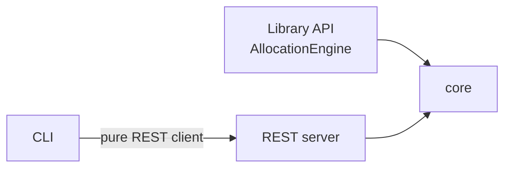

# 🏛️ Malkom Work Allocation Engine — Architecture

> The 10,000-foot view, then the details. Simple pointers — no philosophy.

---

## 🗺️ The big picture

**The one idea:** work items and users live in **your** tables. The engine holds only three things of its own — the **config** you gave it, tiny **runtime state** (cursors, leases), and the **audit trail**.

---

## 🪜 Three tiers of state

| Tier | Examples | Owner |
|---|---|---|
| 📋 **Declarative config** | `QueueDefinition`, bindings, strategy spec, schedule, connections | Host — versioned on every upsert |
| ⏱️ **Runtime snapshots** | Work items, workers, eligibility map | Engine — per run, discarded after |
| 🗄️ **Engine persistence** | Leases (+ fencing tokens), cursors, run/audit records, pause flags | Engine's `StateStore` |

> ⚠️ The strategy is deliberately **three objects with three lifecycles**: `StrategySpec` (config), `AllocationStrategy` (code), `StrategyState` (persistence). Merging them is how engines rot — they never merge here.

---

## 🔌 Ports & adapters

The core talks only to three small ports:

| Port | What it does | Shipped adapter |
|---|---|---|
| `WorkSource` | Fetches assignable items in deterministic order | `SqlBindingAdapter` (SQLite / Postgres / MySQL) |
| `WorkerSource` | Fetches eligible workers (capacity + load) | same |
| `Assigner` | Performs the **guarded** assignment (must be CAS) | same |

Plus `MemoryBackendAdapter` — the reference implementation for prototyping and tests.

> 🧩 **Custom backend?** (REST, Mongo, join-table…) Implement the ports in code, `engine.registerAdapter(name, adapter)`, and point queues at it with `{ adapterRef }`.

**Safety invariant:** config is data-only and injection-proof — identifiers are regex-validated and always dialect-quoted, values are always bound parameters, and the `FilterExpr` AST is the *only* filter language. **No raw SQL in config, ever.**

---

## ⚡ The run pipeline

| Pointer | Why it matters |
|---|---|
| **0 rows affected = `lost` = normal** | The guarded update is the universal correctness backstop |
| **The schedule is the retry mechanism** | No internal retry loops |
| **Intents before writes** | A crash between apply and audit can't orphan an assignment |
| **Auto-pause on repeated schema errors** | Renamed column? Queue pauses with a note; `resume` clears it |
| **Overscan** | Mitigates head-of-line blocking; unmatchable items surface as `skippedNoWorker` |

---

## 🎲 Strategies

| Strategy | Picks… | Use when |
|---|---|---|
| `fifo` | Oldest item first | Fairness / SLA-first |
| `round_robin` | Workers in rotation | Even distribution |
| `least_active` | Worker with lowest open load | Balance the team |
| `custom` | Your registered strategy | Your special logic |

Strategies are **pure functions** — easy to test, easy to reason about.

---

## ⏰ Scheduler

- One cron job per queue, **per-queue timezone** with correct DST handling
- In-process overlap protection — skipped ticks are *recorded*, never silent
- Cross-instance overlap is the **lease's** job (multi-instance = single-writer per queue)

---

## 🗄️ State store

| Implementation | Use it for | Notes |
|---|---|---|
| SQLite (`node:sqlite`) | **Default** — production | WAL, one file, zero native deps |
| In-memory | Tests / ephemeral | Refuses `instances > 1` (no shared store) |

> 🔁 Multi-instance deployments need a **shared** store — that's the only requirement.

---

## 🕸️ Control plane

One core, three shells:

| Trust tooling | What it does |
|---|---|
| `/validate` | Static → live schema introspection → sample rows |
| `/dry-run` | The real pipeline with writes suppressed + the exact SQL shown |

- **Auth:** two hashed static key scopes (admin / read), constant-time comparison. No keys configured = open mode.
- **JSON Schema** for every config document at `/v1/schema/*`.
- **Discovery** at `GET /v1` reflects what's actually registered at boot.

---

## 📊 Observability

| Signal | What it tells you |
|---|---|
| Audit records | Who got what, why, under which config version — queryable & extractable |
| Prometheus metrics | Throughput, assignment outcomes, queue depth |
| `malkom_oldest_unassigned_seconds` | ⚠️ The **starvation alarm** — items waiting too long |
| Retention policies | Runs are queryable and deletable over the API |

---

## 📦 The workEvents convention (optional)

A **convention, not a core dependency** — ships a default work table provisioner + a factory that manufactures a standard `WorkSourceBinding` over it. The core knows nothing about these column names; the factory output passes the same validation as any host binding.

| Rule | Why |
|---|---|
| **Never a mirror** | Either bind your own table, or workEvents *is* the table — a synchronized copy creates dual-write problems the engine can't own |
| **No triggers/rules in host schemas** | That would move engine logic into host schema behavior — a boundary violation |
| **Engine writes exactly** `allocatedTo` + `allocatedOn` | Front-end columns (`completedOn`, `taskStartTime`…) double as the capacity signal |

---

## 🕰️ Time

| Pointer | What it means |
|---|---|
| `assignedAt.mode: 'db-now'` (default) | Stamped with the DB's transaction-consistent **UTC** clock |
| `timezone` (optional) | Only for legacy naive-datetime columns; DST fold warns |
| Cron schedules | Per-queue IANA timezone via croner |

---

## 🔮 Deliberately deferred

Reservations (offer → accept) · escalation-by-age · routing profiles · capacity weights · webhooks · OIDC · cross-queue capacity reservation · Mongo adapter · MSSQL dialect.

> Each has a landing zone in the schema — adding it later is **additive**, not a migration.

---

## 🚀 Where to go next

- [`README.md`](./README.md) — the friendly overview
- [`FRONTEND-GUIDE.md`](./FRONTEND-GUIDE.md) — building UIs on the engine
- Engine root `README.md` — full API + server/CLI walkthrough
